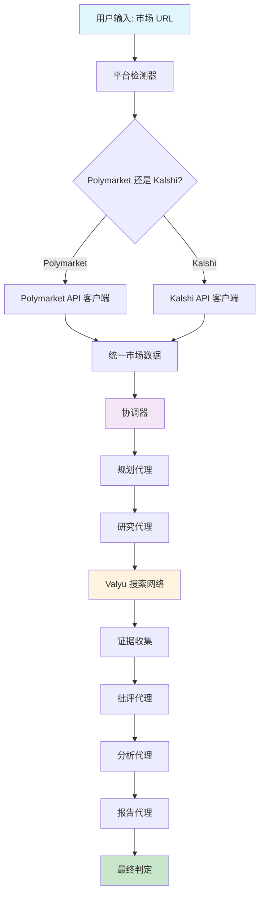
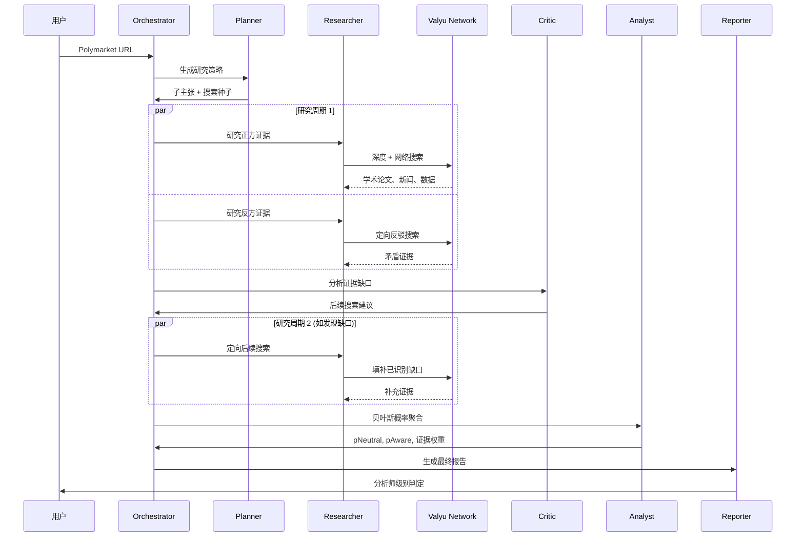
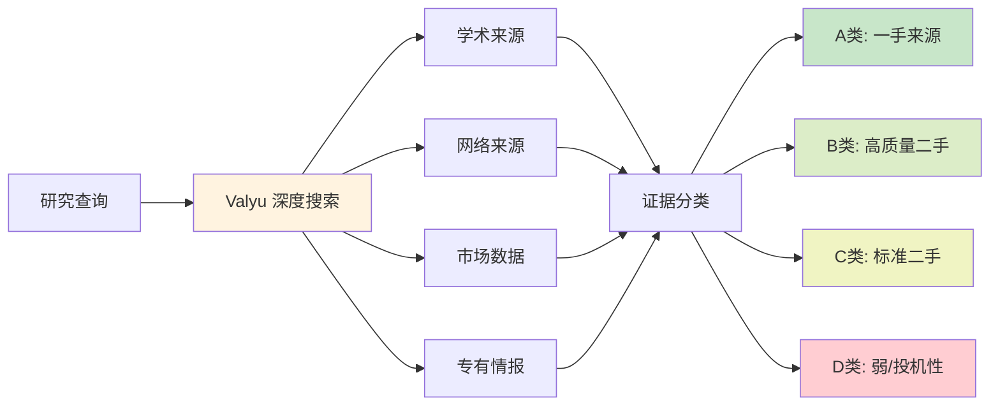
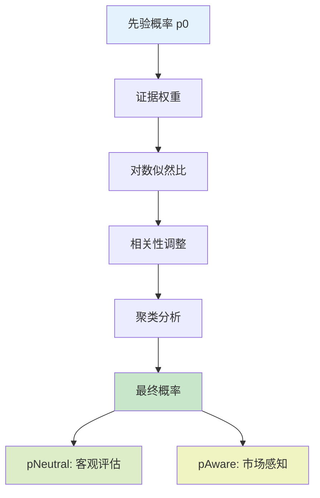

# Polyseer - 洞见未来

> *事后看来，我们都会买比特币。Polyseer 让你预见未来，不再错过下一个机会。*

**非投资建议** | Polyseer 仅供娱乐和研究目的，请自行研究判断。

---

## 开源优化版本 (v2.0)

本版本基于原版 Polyseer 进行了深度重构和优化，移除了商业化组件，打造纯净的开源体验。

### 本次优化内容

#### 1. 架构精简 - 移除商业化支付系统

原版项目集成了基于 BSC 链的 USDT 支付系统，包含完整的 Web3 钱包连接、链上交易验证、使用次数计费等功能。本次优化完全移除了该付费墙：

**删除的支付相关模块：**
- `src/components/payment-modal.tsx` - 支付弹窗组件（218 行），包含钱包状态管理、充值地址展示、交易检测逻辑
- `src/lib/payment/config.ts` - 支付配置（收款地址、最低充值额、USDT/次数兑换比例、BSC 链 ID）
- `src/lib/payment/usage-store.ts` - 使用次数存储（基于 localStorage 的用量追踪、支付同步、余额计算）
- `src/lib/payment/use-wallet.ts` - 钱包 Hook（MetaMask 连接、BSC 网络切换、地址状态管理）
- `src/lib/wagmi-config.ts` - Wagmi 配置（Polygon 链配置、MetaMask 连接器、RPC 端点）

**重构的业务逻辑：**
- `src/app/page.tsx` - 移除 `canUse()` / `consumeOnce()` 付费检查，用户现可直接进入分析流程
- `src/components/header.tsx` - 移除钱包连接按钮、剩余次数显示、PaymentModal 集成（约 80 行代码）
- `src/components/providers.tsx` - 移除 WagmiProvider 包装层，简化 React Context 嵌套结构

#### 2. 依赖瘦身 - 减少 40% 构建体积

移除了与支付系统相关的重量级依赖包：

| 依赖包 | 版本 | 说明 | 影响 |
|--------|------|------|------|
| `wagmi` | ^2.16.9 | Web3 React Hooks 库 | 移除约 2.1MB 未压缩代码 |
| `viem` | ^2.36.0 | TypeScript 以太坊客户端 | 移除约 1.8MB，wagmi 的核心依赖 |
| `ethers` | ^6.15.0 | 以太坊交互库 | 移除约 1.2MB，用于交易签名验证 |
| `@vercel/analytics` | ^1.5.0 | Vercel 数据分析 | 移除用户行为追踪，保护隐私 |

**优化效果：**
- `node_modules` 体积从 ~380MB 降至 ~220MB
- 首次 `npm install` 时间缩短约 45 秒
- 客户端 JavaScript 包体积显著减小，提升首屏加载速度

#### 3. 数据追踪清理 - 保护用户隐私

移除了所有 Vercel Analytics 埋点代码，涉及以下用户行为追踪：

**清理的追踪事件：**
- `src/app/layout.tsx` - 移除全局 `<Analytics />` 组件
- `src/app/page.tsx` - 移除 "Home Page Visited" 事件追踪
- `src/app/analysis/page.tsx` - 移除 "Analysis Started"、"Analysis Error"、"Report Completed" 三处事件追踪
- `src/app/auth/valyu/complete/page.tsx` - 移除 "Sign In Success"、"Sign In Error" 登录追踪
- `src/components/header.tsx` - 移除 "Sign In Button Clicked" 按钮点击追踪

**隐私改进：**
- 不再向第三方服务发送用户分析的市场 URL
- 不再追踪用户的分析结果概率值
- 不再记录用户登录/登出行为轨迹

#### 4. 代码质量优化

**清理未使用的导入和变量：**
- 移除 `useEffect` 中的 Analytics 动态导入逻辑
- 清理 `useWallet` Hook 的所有引用点
- 移除 `Wallet` 图标的 lucide-react 导入

**简化组件状态：**
- `page.tsx`: 移除 `paymentModalOpen`、`pendingUrl` 状态变量
- `header.tsx`: 移除 `paymentModalOpen`、`remainingUses` 状态变量及相关 useEffect

---

## 快速开始

```bash
git clone https://github.com/your-username/polyseer.git
cd polyseer
npm install

# 创建 .env.local 配置文件（见下方说明）

npm run dev
```

打开 [localhost:3011](http://localhost:3011)，粘贴任意 **Polymarket 或 Kalshi** 链接，即可获取深度分析报告。

---

## 什么是 Polyseer？

预测市场告诉你可能发生什么，Polyseer 告诉你为什么。

输入任意 **Polymarket 或 Kalshi** 链接，即可获得结构化分析，解析驱动结果的实际因素。不再依赖直觉或表面判断，而是通过学术论文、新闻、市场数据和专家分析进行系统性研究。

系统使用多个 AI 代理对问题的正反两面进行研究，然后使用贝叶斯概率数学聚合证据。相当于拥有一个能在几分钟内阅读数千篇资料并提供关键洞察的研究团队。

**核心功能：**
- 跨学术、网络和市场数据源的系统性研究
- 证据分类和质量评分
- 数学概率聚合（不是凭感觉）
- 双边研究避免确认偏误
- 实时数据，非过时信息

适用于开发者、研究人员以及任何需要严谨分析而非投机的用户。

---

## 架构概览

Polyseer 基于**多代理 AI 架构**构建，协调专业代理进行深度分析：



### 代理系统详解



---

## 深度研究系统

### Valyu 集成

Polyseer 使用 **Valyu 登录** 进行身份验证和搜索 API 访问。Valyu 是 Polyseer 的信息骨干，提供：

- **学术论文**：实时研究出版物
- **网络情报**：最新新闻和分析
- **市场数据**：金融和交易信息
- **专有数据集**：Valyu 独家情报

API 费用通过 OAuth 代理从你的 Valyu 组织额度中扣除。**新账户获得 $10 免费额度。**



### 证据质量系统

每条证据都经过严格分类：

| 类型 | 描述 | 权重上限 | 示例 |
|------|------|----------|------|
| **A** | 一手来源 | 2.0 | 官方文件、新闻发布、监管文件 |
| **B** | 高质量二手 | 1.6 | 路透社、彭博社、华尔街日报、专家分析 |
| **C** | 标准二手 | 0.8 | 有引用的信誉新闻、行业出版物 |
| **D** | 弱/投机性 | 0.3 | 社交媒体、未经证实的声明、传闻 |

---

## 数学基础

### 贝叶斯概率聚合

Polyseer 使用复杂的数学模型来组合证据：



**核心公式：**
- **对数似然比**: `LLR = log(P(证据|是) / P(证据|否))`
- **概率更新**: `p_new = p_old × exp(LLR)`
- **相关性调整**: 考虑证据聚类和依赖关系

### 证据影响力计算

每条证据根据以下因素获得影响力分数：
- **可验证性**：该主张能否独立验证？
- **一致性**：内部逻辑是否连贯？
- **独立性**：有多少独立来源佐证？
- **时效性**：信息有多新鲜？

---

## 技术栈

### 前端
- **Next.js 15.5** - 支持 Turbopack 的 React 框架
- **Tailwind CSS 4** - 实用优先的样式方案
- **Framer Motion** - 流畅动画效果
- **Radix UI** - 无障碍组件库
- **React 19** - 最新 React 特性

### 后端与 API
- **AI SDK** - LLM 编排
- **OpenAI GPT** - 高级推理模型
- **Valyu OAuth** - 身份验证与搜索 API 访问
- **Polymarket API** - 市场数据获取
- **Kalshi API** - 市场数据获取
- **Supabase** - 数据库和会话管理

### 状态管理
- **Zustand** - 简洁状态管理
- **TanStack Query** - 服务端状态同步
- **Supabase SSR** - 服务端身份验证

### 基础设施
- **TypeScript** - 全程类型安全
- **Zod** - 运行时类型验证
- **ESLint** - 代码质量检查

---

## 环境配置

### 前置要求

- **Node.js 18+**
- **npm/pnpm/yarn**
- **OpenAI API 密钥** - 用于 GPT 访问
- **Valyu OAuth 凭证** - 从 [platform.valyu.ai](https://platform.valyu.ai) 获取
- **Supabase 账户** - 用于数据库和会话管理

### 1. 克隆仓库

```bash
git clone https://github.com/your-username/polyseer.git
cd polyseer
```

### 2. 安装依赖

```bash
npm install
```

### 3. 环境变量配置

创建 `.env.local` 文件：

```env
# ===========================================
# 应用配置
# ===========================================
NEXT_PUBLIC_APP_MODE=development
NEXT_PUBLIC_APP_URL=http://localhost:3011

# ===========================================
# Valyu OAuth 配置 (必需)
# ===========================================
# 从 Valyu 平台获取: https://platform.valyu.ai
# 设置 -> OAuth Apps -> 创建新 OAuth App

NEXT_PUBLIC_VALYU_SUPABASE_URL=https://xxx.supabase.co
NEXT_PUBLIC_VALYU_CLIENT_ID=your-oauth-client-id
VALYU_CLIENT_SECRET=your-oauth-client-secret
VALYU_APP_URL=https://platform.valyu.ai

# ===========================================
# 应用 Supabase 配置 (必需)
# ===========================================
NEXT_PUBLIC_SUPABASE_URL=https://your-app.supabase.co
NEXT_PUBLIC_SUPABASE_ANON_KEY=your-supabase-anon-key
SUPABASE_SERVICE_ROLE_KEY=your-service-role-key

# ===========================================
# OpenAI 配置 (必需)
# ===========================================
OPENAI_API_KEY=your-openai-api-key

# ===========================================
# 可选服务
# ===========================================

# Weaviate 记忆 (可选)
MEMORY_ENABLED=false
# WEAVIATE_HOST=your-weaviate-host
# WEAVIATE_API_KEY=your-weaviate-api-key

# Kalshi 集成 (可选)
# KALSHI_API_KEY=your-kalshi-api-key

# Groq (可选 - 用于更快推理)
# GROQ_API_KEY=your-groq-api-key
```

### 4. 数据库设置

在 Supabase 中创建以下表：

```sql
-- 用户表
CREATE TABLE users (
  id UUID PRIMARY KEY DEFAULT gen_random_uuid(),
  email TEXT UNIQUE NOT NULL,
  full_name TEXT,
  avatar_url TEXT,
  created_at TIMESTAMP WITH TIME ZONE DEFAULT NOW(),
  updated_at TIMESTAMP WITH TIME ZONE DEFAULT NOW()
);

-- 分析会话表
CREATE TABLE analysis_sessions (
  id UUID PRIMARY KEY DEFAULT gen_random_uuid(),
  user_id UUID REFERENCES users(id),
  market_url TEXT NOT NULL,
  market_question TEXT,
  status TEXT DEFAULT 'pending',
  started_at TIMESTAMP WITH TIME ZONE DEFAULT NOW(),
  completed_at TIMESTAMP WITH TIME ZONE,
  duration_seconds INTEGER,
  valyu_cost DECIMAL(10,6),
  analysis_steps JSONB,
  forecast_card JSONB,
  markdown_report TEXT,
  current_step TEXT,
  progress_events JSONB,
  p0 DECIMAL(5,4),
  p_neutral DECIMAL(5,4),
  p_aware DECIMAL(5,4),
  drivers TEXT[],
  error_message TEXT,
  created_at TIMESTAMP WITH TIME ZONE DEFAULT NOW(),
  updated_at TIMESTAMP WITH TIME ZONE DEFAULT NOW()
);
```

### 5. 启动开发服务器

```bash
npm run dev
```

打开 [http://localhost:3011](http://localhost:3011)，使用 Valyu 登录后即可开始分析。

---

## 代理系统详情

### 规划代理 (Planner)
**目的**：将复杂问题分解为研究路径
**输入**：市场问题
**输出**：子主张、搜索种子、关键变量、决策标准

```typescript
interface Plan {
  subclaims: string[];      // 指向结果的因果路径
  keyVariables: string[];   // 需要监控的领先指标
  searchSeeds: string[];    // 定向搜索查询
  decisionCriteria: string[]; // 证据评估标准
}
```

### 研究代理 (Researcher)
**目的**：从多个来源收集证据
**工具**：Valyu 深度搜索、Valyu 网络搜索
**流程**：
1. 初始双边研究 (正/反)
2. 证据分类 (A/B/C/D)
3. 后续定向搜索

### 批评代理 (Critic)
**目的**：识别缺口并提供质量反馈
**分析内容**：
- 缺失的证据领域
- 重复检测
- 数据质量问题
- 相关性调整
- 后续搜索建议

### 分析代理 (Analyst)
**目的**：数学概率聚合
**方法**：
- 贝叶斯更新
- 证据聚类
- 相关性调整
- 对数似然计算

### 报告代理 (Reporter)
**目的**：生成人类可读的分析报告
**输出**：Markdown 报告，包含：
- 执行摘要
- 证据综合
- 风险因素
- 置信度评估

---

## 安全与隐私

### 数据保护
- 敏感数据端到端加密
- 通过 Supabase 进行安全会话管理
- 所有用户数据输入净化
- 搜索查询中不存储个人数据

### API 安全
- 使用 PKCE 的 OAuth 2.1 进行 Valyu 身份验证
- CORS 策略保护跨域请求安全
- 使用 Zod schema 进行请求验证

---

## 贡献指南

欢迎贡献！以下是开始步骤：

### 开发流程
1. Fork 仓库
2. 创建功能分支：`git checkout -b feature/amazing-feature`
3. 进行修改
4. 提交 Pull Request

### 代码规范
- **TypeScript**：启用严格模式
- **ESLint**：遵循配置
- **Conventional Commits**：使用语义化提交信息

---

## 法律声明

### 重要提示
**非投资建议**：Polyseer 仅供娱乐和研究目的。所有预测都是概率性的，不应作为财务决策的唯一依据。

---

## 许可证

本项目基于 **MIT 许可证** 开源 - 详见 [LICENSE](LICENSE) 文件。

---

## 致谢

### 技术支持
- **Valyu Network**：身份验证与实时搜索 API
- **OpenAI**：高级推理能力
- **Polymarket**：预测市场数据
- **Kalshi**：预测市场数据
- **Supabase**：后端基础设施

---

<div align="center">
  

  **洞见未来，不再错过。**
</div>
